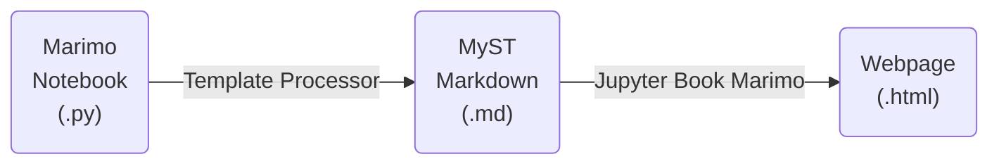
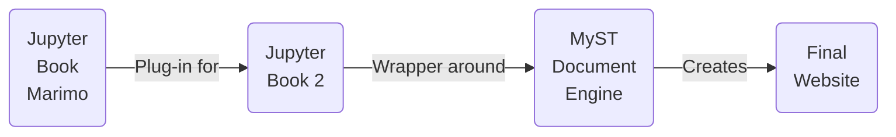

This project is a processor to convert from [marimo](https://docs.marimo.io) notebooks to [MyST](https://mystmd.org/guide) markdown files ready for rendering by [Jupyter-Book-Marimo](https://marimo-team.github.io/jupyter-book-marimo).



Jupyter-Book-Marimo is a plug-in for for [Jupyter Book 2](https://jupyterbook.org) that lets marimo cells be written as [directives](https://mystmd.org/guide/directives), which then run as [islands](https://docs.marimo.io/guides/island_example/) in the browser.



The directive syntax in .md files is:
````
```{marimo} python
:option1: value1
:option2: value2
# code
```
````

The options are:

|Option | Type | Default | Behavior | Template Option |
|-------|------|---------|----------|-----------------------|
| `:eval:` | boolean | `true` | Execute the cell during the build | Yes|
| `:echo:` | boolean | `false` | Render source as static code | Yes|
| `:editor:` | boolean | `false` | Render source in a marimo code editor | Yes|
| `:output:` | boolean | `true` | Render the browser output island | Yes|
| `:server-output:` | boolean | `true` | Include build-time preview HTML in the output island | Yes|
| `:error:` | boolean | `true` | Render marimo error output instead of failing on error MIME output | Yes|
| `:include:` | boolean | `true` | Keep this cell's visible node in the page | Yes|
| `:hide-code:` | boolean | `false` | Hide rendered source when page defaults would show it | No |
| `:hide-output:` | boolean | `false` | Hide rendered output when page defaults would show it | Yes|
| `:disabled:` | boolean | `false` | Skip execution and keep optional visible source | No |
| `:unparsable:` | boolean | `false` | Skip parsing intentionally invalid code | Yes|
| `:name:` | string | none | Set the marimo cell name | No |
| `:column:` | number | none | Set the marimo column index | No |

For template options, the python syntax is:

```py
# jb: option1=value1 option2=value2
```

When the template processor converts the .py file to .md, this comment at the top of a cell will be converted to the corresponding syntax in the .md file. The other values can be directly changed in the marimo editor and therefore cannot be set with comments.
